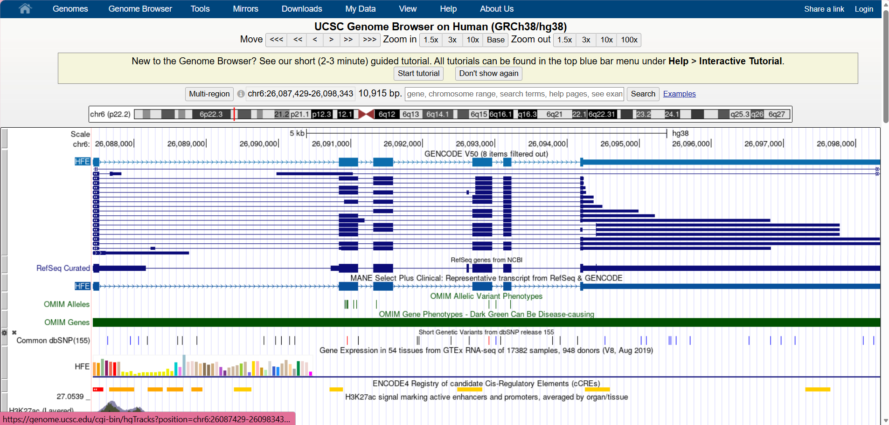

# Exploring a Human Disease Gene Using UCSC Genome Browser and NCBI ClinVar

**Name:** Rachelle May A. Itom  
**Assigned Gene:** HFE  
**Associated Disease:** Hereditary hemochromatosis  

## Bioinformatics Lab Activity

This activity investigates the HFE gene using the UCSC Genome Browser and NCBI ClinVar.

## 2. UCSC Gene Location

The HFE gene was located using the UCSC Genome Browser with the human GRCh38/hg38 assembly.

- **Official gene symbol:** HFE
- **Full gene name:** Homeostatic iron regulator
- **Chromosome:** 6
- **Genome assembly:** GRCh38/hg38
- **Genomic coordinates:** chr6:26,087,429–26,098,343
- **DNA strand:** +
- **Approximate gene size:** 10,915 bp

### Screenshot 1 – HFE Gene Location

