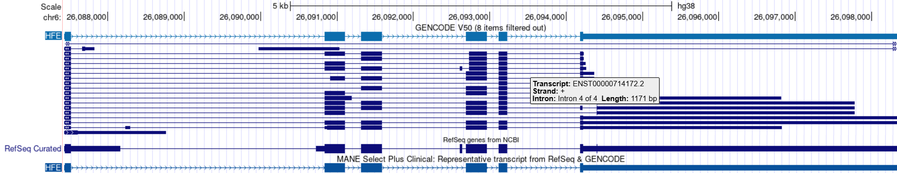
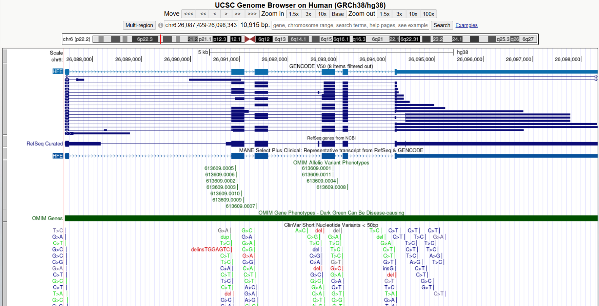
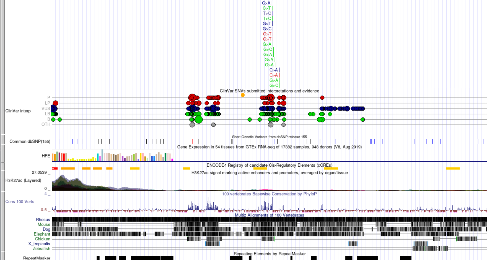
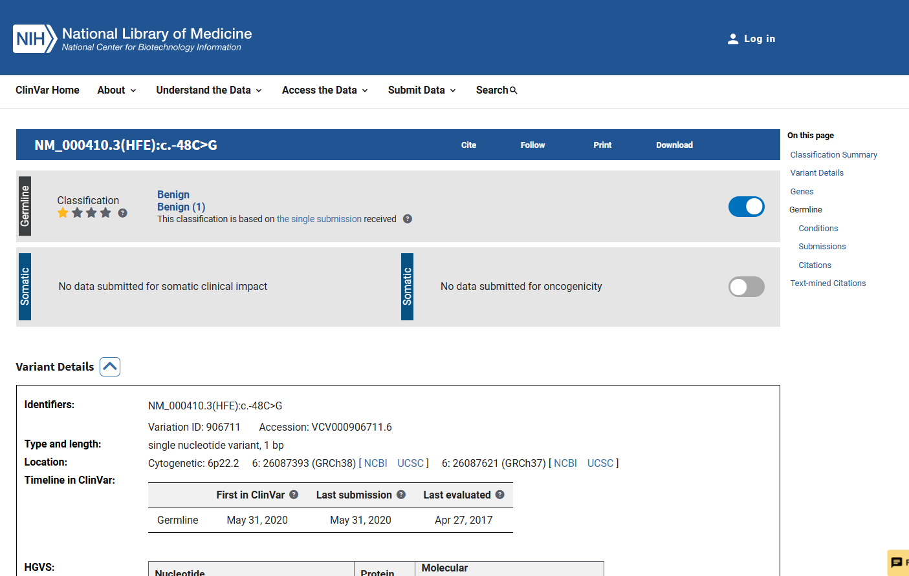
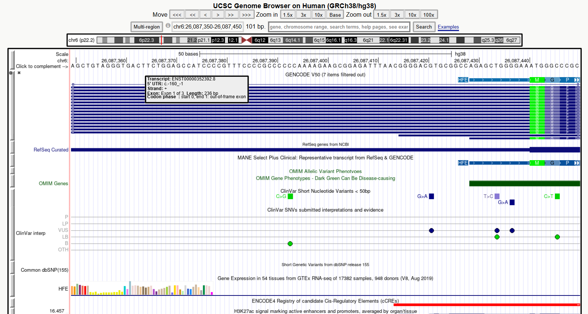

# Exploring a Human Disease Gene Using UCSC Genome Browser and NCBI ClinVar

**Name:** Rachelle May A. Itom  
**Assigned Gene:** HFE  
**Associated Disease:** Hereditary hemochromatosis  

## Bioinformatics Lab Activity

This activity investigates the HFE gene using the UCSC Genome Browser and NCBI ClinVar.

## 2. UCSC Gene Location

The HFE gene was located using the UCSC Genome Browser with the human GRCh38/hg38 assembly.

- **Official gene symbol:** HFE
- **Full gene name:** Homeostatic iron regulator
- **Chromosome:** 6
- **Genome assembly:** GRCh38/hg38
- **Genomic coordinates:** chr6:26,087,429–26,098,343
- **DNA strand:** +
- **Approximate gene size:** 10,915 bp

### Screenshot 1 – HFE Gene Location

## 3. Exons, Introns, and Transcripts

**Selected transcript:** NM_000410.4 (MANE Select Plus Clinical)

- **Number of exons:** 6
- **Multiple transcripts/isoforms visible:** Yes. Multiple transcript models are visible in the GENCODE and RefSeq tracks.
- **Exons:** Exons are represented by the blue boxes in the gene model.
- **Introns:** Introns are represented by the lines connecting the exon boxes.
- **Relative length:** The introns generally appear longer than the exons in the displayed HFE gene model.

### Screenshot 2 – HFE Gene Structure

## 4. Annotation and Conservation

**a. Which gene annotation track did you use?**  
I used the GENCODE V50 and RefSeq/MANE Select Plus Clinical annotation tracks to examine the HFE gene structure.

**b. Were ClinVar-related variant marks visible within or near your gene?**  
Yes. Multiple ClinVar-related variant marks were visible within the HFE gene region, including ClinVar Short Nucleotide Variants and ClinVar submitted interpretations.

**c. Were some regions more conserved than others?**  
Yes. The Cons 100 Verts track showed that some regions had stronger conservation signals than others.

**d. Did conserved regions correspond mainly to exons, introns, both, or another region?**  
The stronger conservation signals appeared mainly around exonic regions, although some conservation was also present in non-exonic regions.

**e. Why can strong conservation suggest biological importance?**  
Strong conservation suggests that a DNA sequence has been maintained across different species because it may have an important biological function. Changes in highly conserved regions may therefore have a greater potential to affect gene function.

### Screenshot 3A – ClinVar Annotations

### Screenshot 3B – Conservation Track

## 5. ClinVar Variant Record

**a. Gene:** HFE

**b. Variant name/HGVS description:** NM_000410.3(HFE):c.-48C>G

**c. rsID or ClinVar Variation ID/VCV accession:** rs41266793; Variation ID 906711; VCV000906711.6

**d. Chromosome and genomic position:** Chromosome 6: 26087393 (GRCh38)

**e. Associated condition/disease:** Hemochromatosis type 1

**f. Clinical significance:** Benign

**g. Review status:** Criteria provided, single submitter

**h. ClinVar record URL:** https://www.ncbi.nlm.nih.gov/clinvar/variation/906711/

### Screenshot 4 – ClinVar Variant Record

## 6. Locating and Interpreting the Variant in UCSC

**Selected variant:** NM_000410.3(HFE):c.-48C>G

**Genomic position:** chr6:26087393 (GRCh38)

### Part F Questions

**a. Where is the variant located relative to your gene?**  
The variant is located upstream of the displayed HFE gene model, before the main HFE transcript structure shown in the UCSC browser.

**b. Is it in an exon, intron, UTR, splice region, or another region?**  
The variant does not appear to fall directly within an exon or intron in the current UCSC browser view. It is located in an upstream noncoding region. The exact UTR boundary is not clearly labeled in the current browser view.

**c. Is it likely in a coding or non-coding region based on the displayed annotations?**  
It is likely in a non-coding region because it is located upstream of the coding sequence and does not show a protein-coding change. The ClinVar record also describes the variant as non-coding for the relevant transcript annotation.

**d. Based on its location and ClinVar information, briefly explain how the variant might affect the gene or gene product.**  
Because the variant is in a non-coding region near the HFE gene, it could potentially affect gene regulation or the expression of the HFE transcript rather than directly changing the amino acid sequence of the HFE protein. However, ClinVar classifies this variant as **Benign**, so the available clinical evidence does not support it as a disease-causing variant.

**e. What additional evidence would be needed before concluding that the variant causes disease?**  
Additional evidence would include functional studies showing an effect on HFE gene expression or function, genetic studies showing that the variant co-segregates with disease, and sufficient clinical and population data supporting a disease-causing effect. These results would need to be consistent with the clinical classification and other available evidence.
  
### Screenshot 5 – Selected Variant in UCSC

